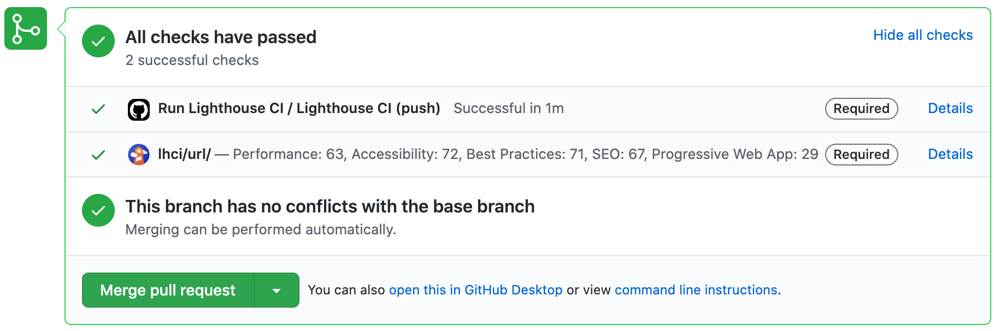
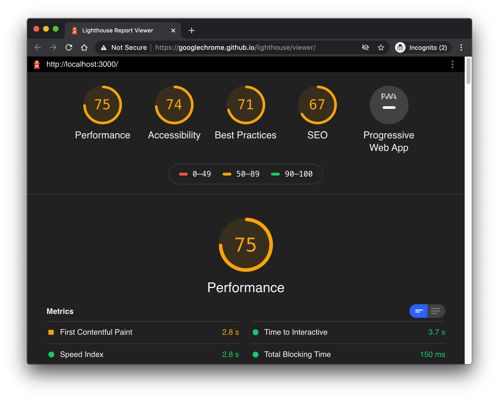
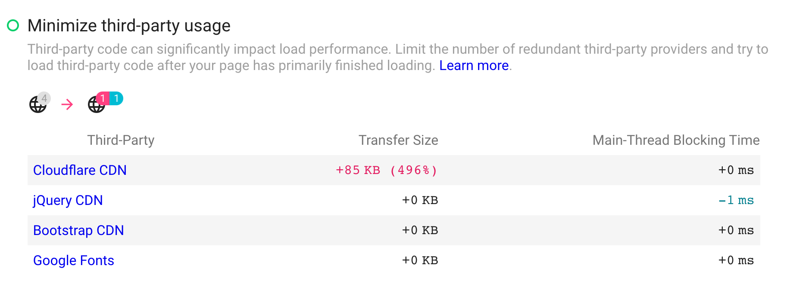
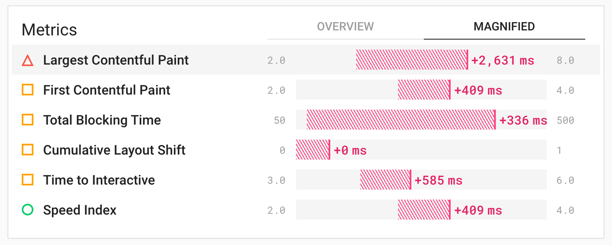
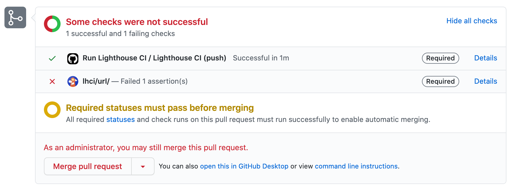
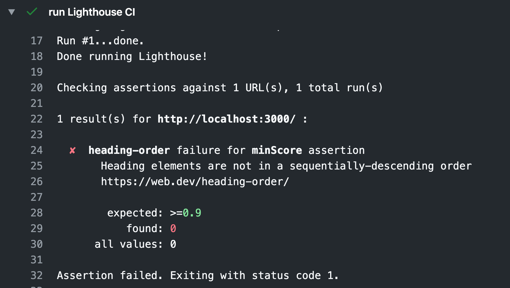

# Lighthouse CI 

🔥️ This uses completely free services.

The definitive guide to automated performance testing using Lighthouse, GitHub Actions and Heroku.

|  | 
|:--:| 
| *Preview of what we'll achieve* |

## Notes

- Please take time to understand how the commands work, inspect the `package.json` file, and approach with a willingness to debug. This is not just copy-and-paste everything and it magically works.
- You will need to read external documentation, such as that for lighthouse, to get this working fully.
- You'll need to adapt some of the commands/instructions to run this in your own fresh repository. It will help to read through this whole guide, taking notes of the commands might need changing.
- Windows users should ensure they have git installed.


__The end goal__: At the end of this, you'll be able to run standard Lighthouse audits, but also __custom audits created by you__.

You can run performance checks, accessibility checks, security checks, on each pull request to your GitHub repo.

---

## 1. Upload lighthouse results

|  | 
|:--:| 
| *Preview of a single Lighthouse report* |

Run lighthouse and upload results to their public server.

While the Lighthouse CI tool does support extra config, let's just run this as one command:

```sh
# from 3-auditing/1-lighthouse
npm run lighthouse # or yarn lighthouse
```

💡️ Go and check what the `lighthouse` script does, in the `package.json`, it's important to understand the following:

- [startServerCommand](https://github.com/GoogleChrome/lighthouse-ci/blob/master/docs/configuration.md#startservercommand)
- [target](https://github.com/GoogleChrome/lighthouse-ci/blob/master/docs/configuration.md#target)
- [url](https://github.com/GoogleChrome/lighthouse-ci/blob/master/docs/configuration.md#url)
- [numberOfRuns](https://github.com/GoogleChrome/lighthouse-ci/blob/master/docs/configuration.md#numberofruns)

Before you continue, please understand each part of the `npm run lighthouse` command.

---

## 2. Upload lighthouse results locally

Upload results to your local lighthouse server.

### 2.1. Start lighthouse CI

|  | 
|:--:| 
| *Lighthouse CI can show how metrics are improving or worsening over time* |

Start the lighthouse CI server on your local machine.

```sh
# from 3-auditing/1-lighthouse
npm run lighthouse-local-server # or yarn lighthouse-local-server
```

Now: check the app is running @ http://localhost:9001

💡️ As usual, go and check what the `lighthouse-local-server` command does (in `package.json`).

### 2.2. Configure lighthouse CI

Configure the lighthouse CI server. The lighthouse wizard tool can configure your lighthouse CI instance, both locally and remotely.

In a new terminal tab:

```sh
# from 3-auditing/1-lighthouse
npm run lighthouse-wizard # or yarn lighthouse-wizard
```

I used the following answers, you can substitute the appropriate values for your own:


```
? Which wizard do you want to run? new-project
? What is the URL of your LHCI server? http://localhost:9001
? What would you like to name the project? learn-browser-testing
? Where is the project's code hosted? https://github.com/umaar/learn-browser-testing
? What branch is considered the repo's trunk or main branch? master
```

💡️ You might want to use your own repository when answering those questions.

After executing that, take note of the `build token`.

### 2.3. Upload lighthouse results locally

|  | 
|:--:| 
| *The Lighthouse CI dashboard gives a handy overview of your page scores* |

Run lighthouse and upload the results to your __local__ lighthouse CI server:

Run the following command, and be sure to substitute `[YOUR_TOKEN]` for your actual `build token`.

💡️ __Important__ - Take time to understand what this command is doing, and how it works:

- [serverBaseUrl](https://github.com/GoogleChrome/lighthouse-ci/blob/master/docs/configuration.md#serverbaseurl)
- [token](https://github.com/GoogleChrome/lighthouse-ci/blob/master/docs/configuration.md#token)
- What is the difference between `--upload.target=lhci` and `--upload.target=temporary-public-storage`?

```sh
# from 3-auditing/1-lighthouse
../../node_modules/.bin/lhci autorun \
	--collect.numberOfRuns=1 \
	--collect.startServerCommand="npm start" \
	--collect.url="http://localhost:3000" \
	--upload.target=lhci \
	--upload.serverBaseUrl="http://127.0.0.1:9001" \
	--upload.token="[YOUR_TOKEN]"
```

#### Windows alternative

```sh
..\\..\\node_modules\\.bin\\lhci autorun ^
	--collect.numberOfRuns=1 ^
	--collect.startServerCommand="npm start" ^
	--collect.url="http://localhost:3000" ^
	--upload.target=lhci ^
	--upload.serverBaseUrl="http://127.0.0.1:9001" ^
	--upload.token="[YOUR_TOKEN]"
```

Now, you can verify the results on your local lighthouse CI server, e.g. at http://localhost:9001

---

## 3. Run lighthouse CI in the cloud

This runs the tool which powers the lighthouse dashboard, to the cloud. Earlier, we ran `npm run lighthouse-local-server` - we're going to run that server online through a hosting platform.

On this occasion, we'll use [heroku](https://www.heroku.com/) since it has a free tier.

### 3.1. Setup heroku

- Make a [heroku.com](heroku.com) account
- Install their [CLI tool](https://devcenter.heroku.com/articles/heroku-cli)

### 3.2. Deploy lighthouse CI to heroku (free)

The lighthouse CI dashboard is completely independent of this `learn-browser-testing` repo, therefore, clone the lhci-heroku starter kit __outside__ of this current project. Instructions below:

```sh
# For example, in ~/code or wherever your code projects live
git clone https://github.com/umaar/lhci-heroku.git
cd lhci-heroku

# run this command just once
heroku login

# Create your new project in heroku
heroku create

# Create a new database (https://devcenter.heroku.com/articles/heroku-postgresql#provisioning-heroku-postgres)
heroku addons:create heroku-postgresql:hobby-dev

# The "git remote" named "heroku" is automatically configured, you just need to run `git push heroku master` to push to the heroku servers
git push heroku master

# Finally, start the app
heroku ps:scale web=1
```

### 3.3. Run the lighthouse wizard

Previously, we ran the lighthouse wizard to configure a __local instance__ of the lighthouse CI tool. Now, we'll use that exact same wizard to configure the __remote heroku instance__ of the lighthouse CI tool.

```sh
# While in the `lhci-heroku` folder, run:
npm install
npx lhci wizard
```

I gave these answers. In the answers below, configure the URL so it points to the platform you've deployed to Heroku.

```
? Which wizard do you want to run? new-project
? What is the URL of your LHCI server? https://salty-headland-92476.herokuapp.com/
? What would you like to name the project? lhci-heroku
? Where is the project's code hosted? https://github.com/umaar/lhci-heroku
? What branch is considered the repo's trunk or main branch? master
```

Take note of the tokens which are presented to you.

### 3.4. Upload lighthouse results to heroku

At this point, you have:

- Run lighthouse and uploaded results to their (the lighthouse team) public temporary storage 
- Run lighthouse and uploaded results to your local instance of lighthouse ci

Now, you will run lighthouse and upload the results to your __heroku lighthouse CI server__:

- Substitute `[YOUR_TOKEN]` for your actual `build token`.
- Substitute `[YOUR BASE URL]` for your heroku URL.

```sh
# Back in 3-auditing/1-lighthouse

../../node_modules/.bin/lhci autorun \
	--collect.numberOfRuns=1 \
	--collect.startServerCommand="npm start" \
	--collect.url="http://localhost:3000" \
	--upload.target=lhci \
	--upload.serverBaseUrl="[YOUR BASE URL]" \
	--upload.token="[YOUR_TOKEN]"
```

#### Windows alternative

```sh
..\\..\\node_modules\\.bin\\lhci autorun ^
	--collect.numberOfRuns=1 ^
	--collect.startServerCommand="npm start" ^
	--collect.url="http://localhost:3000" ^
	--upload.target=lhci ^
	--upload.serverBaseUrl="[YOUR BASE URL]" ^
	--upload.token="[YOUR_TOKEN]"
```

Be sure to verify the results on your heroku lighthouse CI server.

---

## 4. Connect lighthouse with github

|  | 
|:--:| 
| *We'll configure GitHub to require successful checks for merging* |

You can do this for your own repository, or just follow along by observing.

Starting with GitHub actions, you need to add an actions file.

### 4.1. Add an action file

This [action file](https://github.com/umaar/learn-browser-testing/blob/master/.github/workflows/lighthouse-ci.yaml) is a sensible starting point. Just add it in your repo, under `.github/workflows/lighthouse-ci.yaml`.

💡️ If you've never used GitHub actions before, spend a bit of time [reading about them](https://docs.github.com/en/actions/reference).

Note the final run command which I've used:

```sh
npm run --prefix 3-auditing/1-lighthouse lighthouse-private-with-error
```

I've resorted to this command because of the directory structure of this particular repository, and because that command above is run from the `root` of the repo.

If you're doing this in your own repo, you'll want to simplify that command to something like `npm test` or `npm run lighthouse`, and make sure the relevant script definition is in your `package.json`.

### 4.2. Enable the status check

|  | 
|:--:| 
| *We'll configure GitHub to require that all checks were successful before merging* |

Now, configure a Lighthouse 'status' message to appear under pull requests. This can inform you whether or not the pull request passes the lighthouse audit.

1. Open https://github.com/apps/lighthouse-ci
2. Click `Configure`
3. Enable for the repo you are interested in
4. Click authorise

Observe the message like:

```
Authorized
Save the token below in a safe place.
This is the only time it will be visible to you!
Store the token as LHCI_GITHUB_APP_TOKEN in your build environment.

abc:123
```

5. Add the token as a GitHub secret, e.g. https://github.com/umaar/learn-browser-testing/settings/secrets/new

	+ Token name = `LHCI_GITHUB_APP_TOKEN`
	+ Value = `[value from the message you saw earlier]`


💡️ Understand why we are adding this as a secret. Hint, we added `LHCI_GITHUB_APP_TOKEN` in our actions file which exposes this as an [environment variable](https://docs.github.com/en/actions/configuring-and-managing-workflows/using-environment-variables).

### 4.3. Make lighthouse mandatory

Make the status check mandatory for merging a PR

If the status check reports a failure, by default, this will not block pull requests from being merged. We can change this behaviour:

1. Add a new [protection rule](https://github.com/umaar/learn-browser-testing/settings/branch_protection_rules/new).
	+ GitHub Repo > Settings > Branches > Branch protection rules > Add rule
2. Enter the following:
	+ Branch name pattern = *
	+ Require status checks to pass before merging = enabled
	+ Require branches to be up to date before merging = enabled
	+ Enable the status checks = Lighthouse CI and lhci/url/

---

## 5. Finishing up

|  | 
|:--:| 
| *GitHub provides full console output logs so you can debug* |

That was quite a few steps, but it should all be working now.

Test this by making a PR to your repo, do you see the Lighthouse status checks? You can use their assertions feature (e.g. fail when this performance metric is too low) to block pull requests from merging.

Here's a good way to check, by failing on the `heading-order` error. It's simple enough that you can add in some HTML like this to make the build pass/fail:

```html
<h2>heading 2</h2>
<h1>heading 1</h1>
<h3>heading 3</h3>
```

Here's the command to run:

```sh
# from 3-auditing/1-lighthouse, or run this in your own repo
# this is using my personal token and personal dashboard, feel free to swap with your own
../../node_modules/.bin/lhci autorun \
	--collect.numberOfRuns=1 \
	--collect.startServerCommand='npm start' \
	--collect.url='http://localhost:3000' \
	--upload.target=lhci \
	--upload.serverBaseUrl='[YOUR_HEROKU_URL]' \
	--upload.token='[YOUR_TOKEN]' \
	--assert.assertions.heading-order=error
```

💡️ Read up on the [`assertions`](https://github.com/GoogleChrome/lighthouse-ci/blob/master/docs/configuration.md#assertions) feature of the lighthouse ci tool.

---

## Example dashboard

Here's [my dashboard](https://salty-headland-92476.herokuapp.com/).