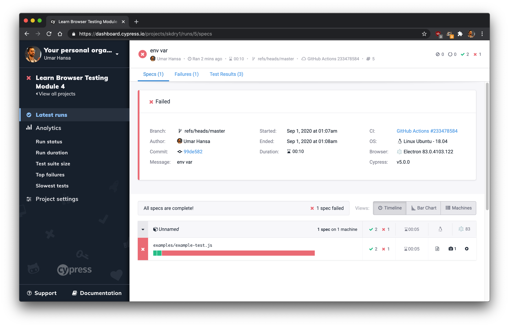
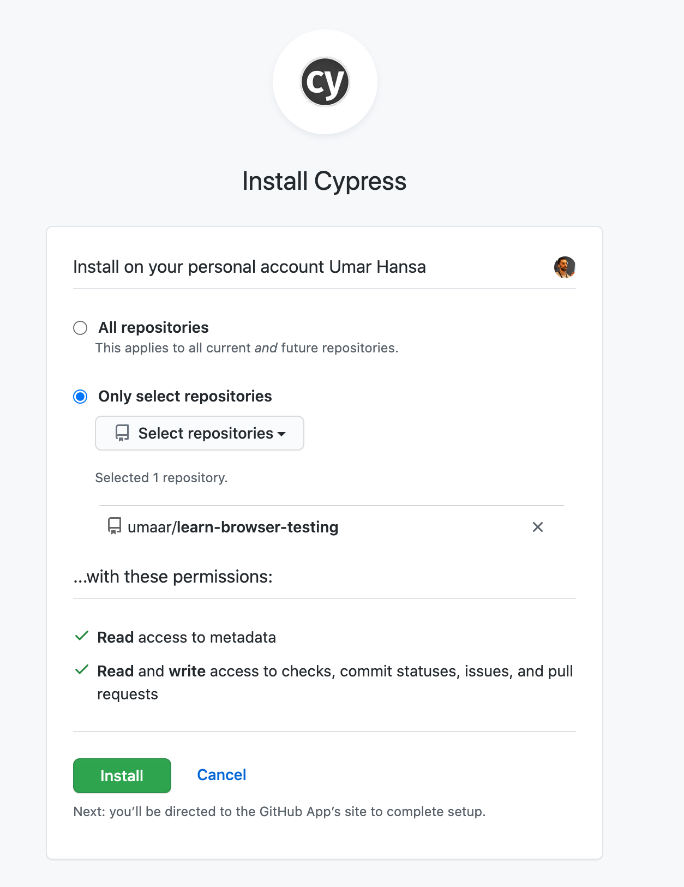

## To run

```sh
CYPRESS_PROJECT_ID=YOUR_ID CYPRESS_RECORD_KEY=YOUR_KEY ../../../node_modules/.bin/cypress run --record
```

## Example

https://github.com/umaar/learn-browser-testing/pull/10

## Preview

Here's what it looks like when run via GitHub actions

|  | 
|:--:| 
| *Preview of GitHub actions output* |

### Permissions

You need to authorise Cypress with GitHub, from their Cypress Dashboard service.

